# Akademik (Chen Notasyonu) ER Diyagramı

Gönderdiğiniz fotoğraftaki diyagram "Chen Notasyonu" adı verilen akademik ve kavramsal veri modelidir.
Kavramsal modellerde tablolar **Dikdörtgen (Varlık / Entity)**, ilişkiler **Eşkenar Dörtgen (İlişki / Relationship)** ve kolonlar **Elips (Nitelik / Attribute)** şekilleri ile çizilir. Primary Key'lerin altı çizilir.

Aşağıdaki Mermaid kodunu herhangi bir [Mermaid Canlı Editörüne (mermaid.live)](https://mermaid.live) yapıştırarak görselini alabilir veya doğrudan Markdown destekleyen bir platformda görüntüleyebilirsiniz.

```mermaid
flowchart TD
    %% Stil Tanımlamaları
    classDef entity fill:#e1f5fe,stroke:#0288d1,stroke-width:2px;
    classDef attribute fill:#ffffff,stroke:#757575,stroke-width:1px;
    classDef relation fill:#fff3e0,stroke:#f57c00,stroke-width:2px,shape:diamond;

    %% Varlıklar (Dikdörtgenler)
    Musteri[Müşteri]:::entity
    Siparis[Sipariş]:::entity
    Urun[Ürün]:::entity
    Kategori[Kategori]:::entity
    Tedarikci[Tedarikçi]:::entity
    Fatura[Fatura]:::entity

    %% Nitelikler (Elipsler)  - Müşteri
    M_ID([<u>Müşteri_ID</u>]):::attribute
    M_Ad([Ad_Soyad]):::attribute
    M_Tel([Telefon]):::attribute
    Musteri --- M_ID
    Musteri --- M_Ad
    Musteri --- M_Tel

    %% Nitelikler - Sipariş
    S_ID([<u>Sipariş_ID</u>]):::attribute
    S_Tarih([Tarih]):::attribute
    S_Tutar([Tutar]):::attribute
    Siparis --- S_ID
    Siparis --- S_Tarih
    Siparis --- S_Tutar

    %% Nitelikler - Ürün
    U_ID([<u>Ürün_ID</u>]):::attribute
    U_SKU([<u>SKU</u>]):::attribute
    U_Ad([Ürün_Adı]):::attribute
    U_Stok([Stok_Miktarı]):::attribute
    Urun --- U_ID
    Urun --- U_SKU
    Urun --- U_Ad
    Urun --- U_Stok

    %% Nitelikler - Kategori
    K_ID([<u>Kategori_ID</u>]):::attribute
    K_Ad([Kategori_Adı]):::attribute
    Kategori --- K_ID
    Kategori --- K_Ad

    %% Nitelikler - Tedarikçi
    T_ID([<u>Tedarikçi_ID</u>]):::attribute
    T_Firma([Firma_Adı]):::attribute
    T_Vergi([Vergi_No]):::attribute
    Tedarikci --- T_ID
    Tedarikci --- T_Firma
    Tedarikci --- T_Vergi

    %% Nitelikler - Fatura
    F_ID([<u>Fatura_ID</u>]):::attribute
    F_No([Fatura_No]):::attribute
    F_Tur([Tür]):::attribute
    F_Tarih([Tarih]):::attribute
    Fatura --- F_ID
    Fatura --- F_No
    Fatura --- F_Tur
    Fatura --- F_Tarih

    %% İlişkiler (Eşkenar Dörtgenler)
    Verir{Verir}:::relation
    S_Kapsar{Sipariş<br>Kapsar}:::relation
    Aittir{Aittir}:::relation
    TedarikEder{Tedarik Eder}:::relation
    SatisKesilir{Satış Faturası<br>Kesilir}:::relation
    AlisKesilir{Alış Faturası<br>Kesilir}:::relation
    F_Icerir{Fatura<br>İçerir}:::relation

    %% M:N İlişkilere Ait Nitelikler
    S_Miktar([S_Miktar]):::attribute
    S_BirimFiyat([Birim_Fiyat]):::attribute
    S_Kapsar --- S_Miktar
    S_Kapsar --- S_BirimFiyat

    F_Miktar([F_Miktar]):::attribute
    F_Kdv([KDV_Oranı]):::attribute
    F_Icerir --- F_Miktar
    F_Icerir --- F_Kdv

    %% Temel Bağlantılar ve Kardinaliteler (1, M, N)
    Musteri ---|1| Verir
    Verir ---|N| Siparis

    Siparis ---|M| S_Kapsar
    S_Kapsar ---|N| Urun

    Urun ---|N| Aittir
    Aittir ---|1| Kategori

    Tedarikci ---|1| TedarikEder
    TedarikEder ---|N| Urun

    Musteri ---|1| SatisKesilir
    SatisKesilir ---|N| Fatura

    Tedarikci ---|1| AlisKesilir
    AlisKesilir ---|N| Fatura

    Fatura ---|M| F_Icerir
    F_Icerir ---|N| Urun
```

