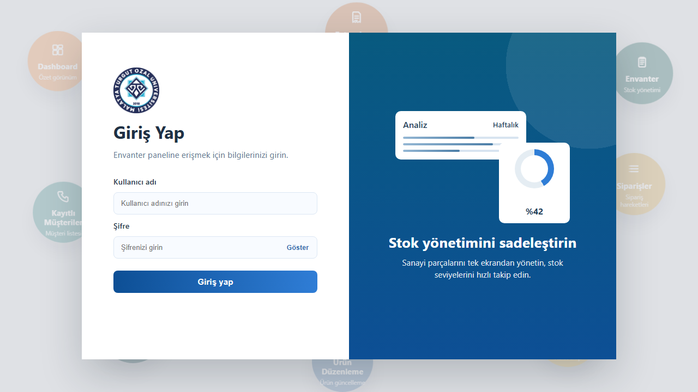
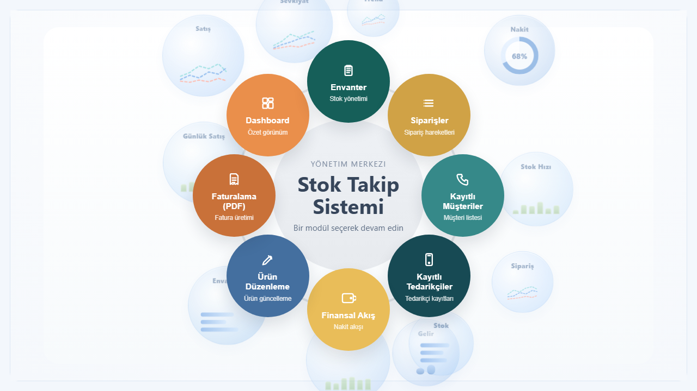
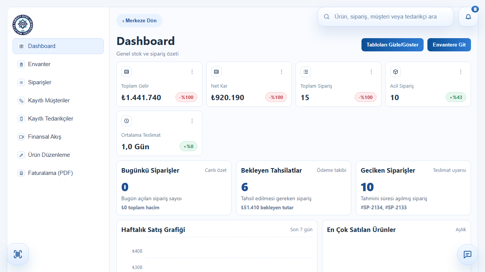
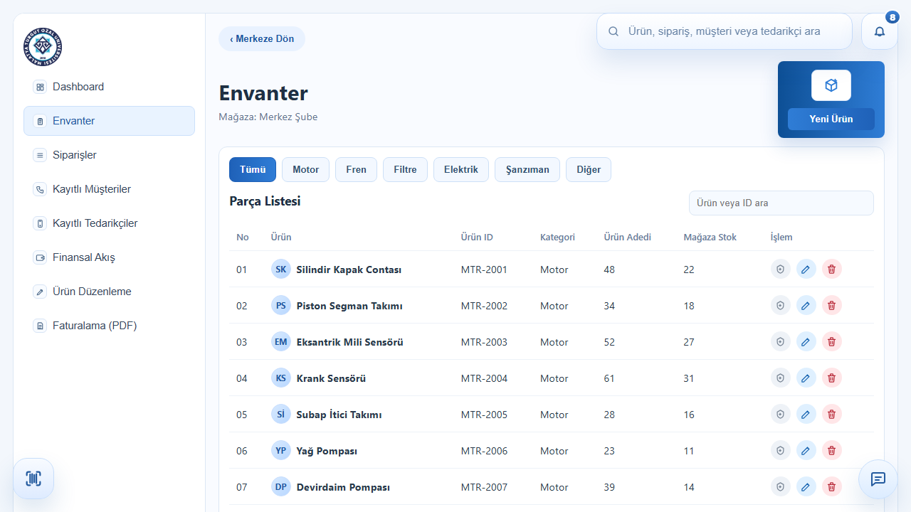
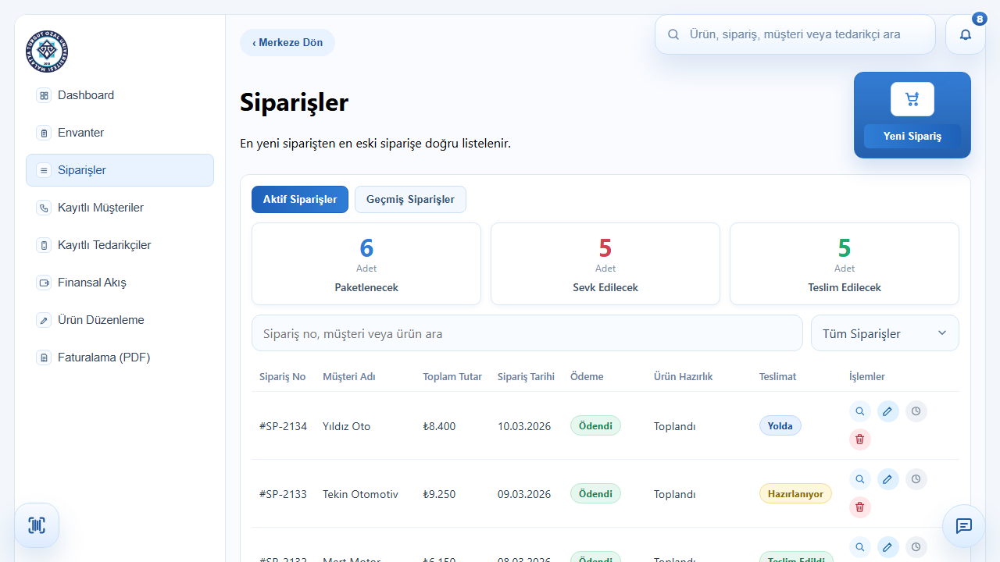
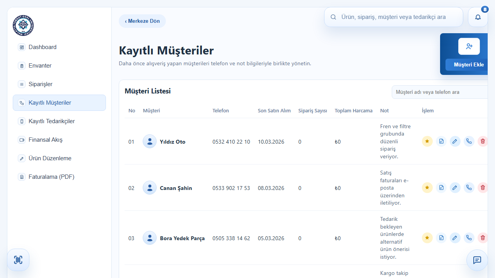

# Yazılım Mühendisliği Projesi

Bu proje **Laravel (Backend)** ve **React / Vite (Frontend)** kullanılarak geliştirilmektedir. Veritabanı olarak **MAMP üzerinden MySQL** kullanılmaktadır.

## 🚀 Geliştirme Ortamı Gereksinimleri

Projeyi kendi bilgisayarınızda çalıştırmak için aşağıdaki yazılımların kurulu olması gerekmektedir:
* **MAMP** (PHP ve MySQL için)
* **Node.js** (Frontend paketleri ve Vite sunucusu için)
* **Composer** (Laravel / PHP paket yönetimi için)

---

## 🛠️ 1. MAMP ve Veritabanı Kurulumu

1. Bilgisayarınızda **MAMP** uygulamasını açın ve **Start Servers** butonuna basarak **Apache** ve **MySQL** sunucularını başlatın.
2. MAMP kontrol panelinden veya tarayıcınızdan `http://localhost/phpMyAdmin` adresine gidin.
3. `yazilim_db` adında yeni bir veritabanı (Database) oluşturun. `Karşılaştırma (Collation)` olarak `utf8mb4_unicode_ci` seçmeniz önerilir.

---

## ⚙️ 2. Backend (Laravel) Kurulumu

Terminal (Komut Satırı) açın ve projenin ana dizinindeyken `backend` klasörüne girin:

```bash
cd backend
```

1. **Gerekli PHP Paketlerini Yükleyin:**
Eğer global composer kullanıyorsanız:
```bash
composer install
```
*(Eğer composer MAMP içindeki PHP'yi görmüyorsa kendi PHP yolunuzu belirterek çalıştırabilirsiniz: `C:\MAMP\bin\php\php8.3.1\php.exe composer.phar install` veya sadece `composer install` çalışabilir.)*

2. **Çevre Değişkenleri (Environment) Dosyasını Oluşturun:**
Projeyi github'dan çektiğinizde `.env` dosyası bulunmayabilir.
```bash
cp .env.example .env
```

3. **Uygulama Anahtarını Üretin:**
```bash
php artisan key:generate
```
*(Eğer hata alırsanız MAMP PHP yolunuzu kullanın: `C:\MAMP\bin\php\php8.3.1\php.exe artisan key:generate`)*

4. **Veritabanı Tablolarını Oluşturun (Migration):**
Veritabanınızı tanımlamıştık (yazilim_db). `.env` dosyasındaki veritabanı bilgileriniz şu şekilde olmalıdır:
```ini
DB_CONNECTION=mysql
DB_HOST=127.0.0.1
DB_PORT=3306
DB_DATABASE=yazilim_db
DB_USERNAME=root
DB_PASSWORD=root
```
*(Genelde MAMP varsayılan MySQL kullanıcı adı: `root` ve şifresi: `root`'tur).*

Şimdi veritabanı tablolarını içeri aktarın:
```bash
php artisan migrate
```
*(MAMP hata verirse: `C:\MAMP\bin\php\php8.3.1\php.exe artisan migrate`)*

5. **Backend Sunucusunu Başlatın:**
```bash
php artisan serve
```
*(MAMP hata verirse: `C:\MAMP\bin\php\php8.3.1\php.exe artisan serve`)*
Sunucu başarıyla başladığında `http://127.0.0.1:8000` adresinden API'nize erişebilirsiniz.

---

## 🎨 3. Frontend (React) Kurulumu

Terminal'de projede yeni bir sekme açın ve ana dizindeyken `frontend` klasörüne girin:

```bash
cd frontend
```

1. **Gerekli Node.js Paketlerini Yükleyin:**
```bash
npm install
```

2. **Geliştirme Sunucusunu Başlatın:**
```bash
npm run dev
```

Terminal'de size verilen yerel adresi (Genellikle `http://localhost:5173/`) tarayıcınızda açarak projeyi görüntüleyebilirsiniz.

---

## 📌 Özet Geliştirme Akışı (Her gün çalışmaya başlarken)

1. **MAMP'i başlatın** (MySQL açık olmalı).
2. Bir terminal sekmesinde `backend` klasörüne gidip **`php artisan serve`** komutuyla API'yi başlatın.
3. Diğer bir terminal sekmesinde `frontend` klasörüne gidip **`npm run dev`** komutuyla React'i başlatın.

Kodlamaya hazırsınız! İyi çalışmalar ekibim! 🎉

---

## Frontend Giris Bilgileri

Login ekrani test bilgileri:

- Kullanici adi: `admin`
- Sifre: `admin123`

---

## 📸 Ekran Görüntüleri

Aşağıda projeye ait bazı ekran görüntülerini inceleyebilirsiniz:

### 1. Giriş Ekranı (Login)


### 2. Merkez / Ana Menü


### 3. Dashboard / Özet


### 4. Envanter Yönetimi


### 5. Siparişler


### 6. Müşteriler

